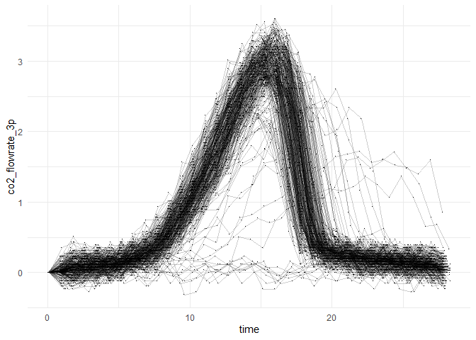
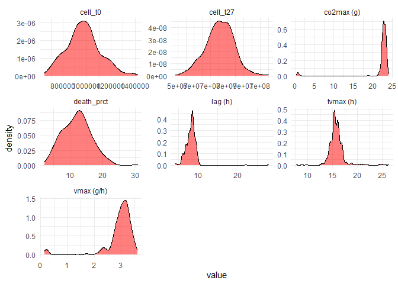
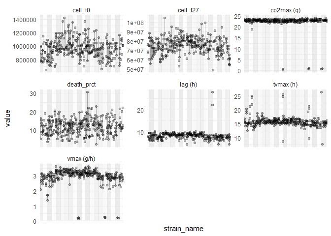
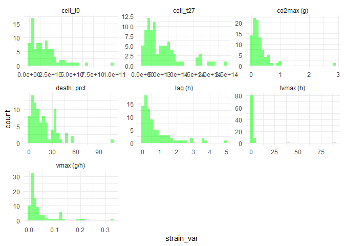
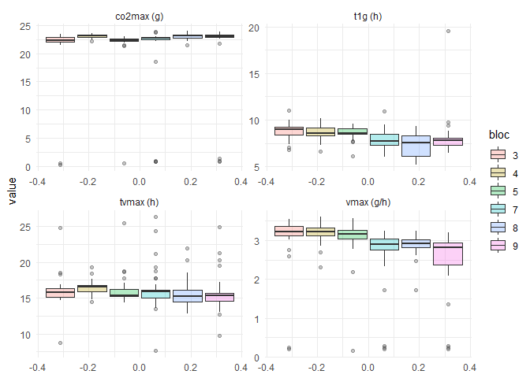

```r
library(magrittr)
library(tidyr)
library(dplyr)
library(stringr)
library(ggplot2)
library(lme4)
```

# Data import

```r
source("scripts/import_data.R")

head(data_cyto)
```

```
## # A tibble: 6 x 11
##   date  strain_name robot robot_id robot_inoc_id position bloc  cell_t0 cell_t27
##   <chr> <chr>       <chr> <chr>    <chr>            <dbl> <fct> <chr>   <chr>   
## 1 2021~ B32-B10     Phen~ R20-202~ 25                   1 1     973940  55208000
## 2 2021~ B29-1       Phen~ R20-202~ 34                   3 1     1009320 50224000
## 3 2021~ B55-A4      Phen~ R20-202~ 28                   5 1     1031260 60560000
## 4 2021~ B29-9       Phen~ R20-202~ 36                   7 1     1147000 55224000
## 5 2021~ B29-5       Phen~ R20-202~ 35                   9 1     915780  62216000
## 6 2021~ B16-H4      Phen~ R20-202~ 7                   12 1     1006280 83248000
## # ... with 2 more variables: death_prct <chr>, notes <chr>
```

```r
head(data_phenot)
```

```
## # A tibble: 6 x 8
##   robot_id         date_hour   time weight_loss position tube_format co2_cumul
##   <chr>            <date>     <dbl>       <dbl>    <int> <chr>           <dbl>
## 1 R20-20210930-001 2021-09-30 0.607        42.9        1 R20            0     
## 2 R20-20210930-001 2021-09-30 1.45         42.9        1 R20            0     
## 3 R20-20210930-001 2021-09-30 2.29         42.9        1 R20            0     
## 4 R20-20210930-001 2021-09-30 3.13         42.9        1 R20            0.0658
## 5 R20-20210930-001 2021-09-30 3.97         42.9        1 R20            0     
## 6 R20-20210930-001 2021-09-30 4.82         42.9        1 R20           -0.197 
## # ... with 1 more variable: co2_flowrate_3p <dbl>
```

# Functions

`weight_to_cumul` : function converting weight loss to cumulated CO2 production with the 
assumption that the lost weight is only/mostly CO2.

*Author : Hugo Devillers*

```r
weight_to_cumul <- function(w, start = 2, t.ref = 2, vol = 15.2) {

  # Compute the weight of reference
  w.ref <- NULL
  w.len <- length(w)
  if( length(t.ref) == 1 ) {
    w.ref <- rep(w[t.ref], w.len)
  } else {
    w.ref <- rep(mean(w[t.ref]), w.len)
  }

  # Compute the cumulated values
  out <- (w.ref - w) / vol * 1000

  # Reset to 0 first values if required
  if( start > 1) {
    out[seq(1, start-1, by=1)] <- 0
  }

  return(out)
}
```

`moving_diff` : function computing a moving difference between points separated of l-1 points to estimate the local slope (i.e. CO2 flow rate, here) in the middle of these two points.

*Author : Hugo Devillers*

```r
moving_diff <- function(x, ti, l=3) {

  # Extract parameters
  r <- floor(l/2)
  n <- length(x)

  # Extend time
  dt1 <- ti[2] -ti[1]
  dtn <- ti[n] - ti[n-1]
  exti1 <- seq(ti[1] - n * dt1, ti[1] - dt1, by = dt1)
  extin <- seq(ti[n] + dtn, ti[n] + n * dtn, by= dtn)
  ti <- c(exti1, ti, extin)

  # Extend x (values)
  x <- c(rep(x[1], r), x, rep(x[n], r))

  # New parameters
  n <- length(x)
  from <- 1:(n-l+1)
  to <- l:n

  # Compute sliding weighted diff
  tmp <- mapply(function(fr, to, r, x, ti){
    num <- mean(x[(fr+r):to]) - mean(x[fr:(fr+r)])
    #den <- mean(ti[(fr+r):to]) - mean(ti[fr:(fr+r)])
    den <- mean(ti[c((fr+r),to)]) - mean(ti[c(fr,(fr+r))])
    return( num / den )
  }, fr = from, to = to, MoreArgs = list(x = x, r=r, ti=ti), SIMPLIFY = TRUE)

  # Return the output
  return(tmp) 
}
```

# Extraction of parameters

Computes of CO<sub>2</sub> cumulation and CO<sub>2</sub> flow rate at each time $t$.

```r
data_phenot %<>%
  group_by(robot_id) %>%
  arrange(robot_id, time) %>%
  mutate(co2_cumul = weight_to_cumul(w = weight_loss, start = 2, t.ref = c(2,3), 
                                     vol = 15.2),
         co2_flowrate_3p = moving_diff(x = co2_cumul, ti = time, l = 3)) %>%
  ungroup()
```

# Extracts statistics from the CO2 cumulation (g) and CO2 flow rate (g/h)

```r
data_phenot_parms <- data_phenot %>%
  group_by(robot_id) %>%
  summarise(date_start = min(date_hour), # Moment of the first mesure
            date_end = max(date_hour), # Moment of the last measure
            co2max = max(co2_cumul), # Maximum cumulated CO2
            vmax = max(co2_flowrate_3p), # Maximum CO2 flow rate
            tvmax = time[which(co2_flowrate_3p == max(co2_flowrate_3p))], # Time at the maximum CO2 flow rate
            t1g = time[min(which(co2_cumul > 1))]) %>% # Latency : time at which cumulated CO2 reaches 1 for the first time
  ungroup() %>%
  mutate(strain_name = data_cyto$strain_name[match(robot_id, data_cyto$robot_id)])
```

`date_start` : moment of the first mesure

`date_end` : Moment of the last measure

`co2max` : Maximum cumulated CO2

`vmax` : Maximum CO2 flow rate

`tvmax` : Time at the maximum CO2 flow rate

`t1g` : time at which cumulated CO2 reaches 1 for the first time

# Data overview

## Trends of weight loss time

We don't see a lot of variability.

```r
ggplot(data_phenot) +
  aes(x = time, y = co2_cumul, group = robot_id) +
  geom_point(shape = ".") +
  geom_line(alpha = 0.2) +
  theme_minimal()
```

<!-- -->

## Trends of flow rate over time

```r
ggplot(data_phenot) +
  aes(x = time, y = co2_flowrate_3p, group = robot_id) +
  geom_point(shape = ".") +
  geom_line(alpha = 0.2) +
  theme_minimal()
```

<!-- -->

## Distributions of the parameters ($t_{VMAX}$, $V_{MAX}$, $t_{1g}$, $CO2_{MAX}$)

```r
data_phenot_parms_tmp <- data_phenot_parms %>%
  mutate(bloc = data_cyto$bloc[match(robot_id, data_cyto$robot_id)]) %>%
  pivot_longer(cols = c("co2max", "vmax", "tvmax", "t1g"),
               names_to = "parameter", values_to = "value")
```

## Global variability of each parameter

```r
data_phenot_parms_tmp %>%
  mutate(parameter = case_when(parameter == "co2max" ~ paste(parameter, "(g)"),
                               parameter == "vmax" ~ paste(parameter, "(g/h)"),
                               parameter == "tvmax" ~ paste(parameter, "(h)"),
                               parameter == "t1g" ~ paste(parameter, "(h)"))) %>%
  ggplot() +
  aes(x = value) +
  geom_density(fill = alpha("red", 0.5)) +
  facet_wrap(~parameter, scales = "free") +
  theme_minimal()
```

<!-- -->

## By strain

<!-- ### The 3 replicates of each strain are bound with a line -->

```r
data_phenot_parms_tmp %>%
  mutate(parameter = case_when(parameter == "co2max" ~ paste(parameter, "(g)"),
                               parameter == "vmax" ~ paste(parameter, "(g/h)"),
                               parameter == "tvmax" ~ paste(parameter, "(h)"),
                               parameter == "t1g" ~ paste(parameter, "(h)"))) %>%
  ggplot(., aes(y = value, group = strain_name, x = strain_name)) +
  geom_point(alpha = 0.3) +
  geom_line(alpha = 0.3) +
  facet_wrap(~parameter, scales = "free") +
  theme_minimal() +
  theme(axis.text.x = element_blank())
```

<!-- -->
Strains for which $CO2_{MAX}$ is under 5 grams :

```r
data_phenot_parms_tmp %>% filter(parameter == "co2max", value < 5)
```

```
## # A tibble: 9 x 7
##   robot_id         date_start date_end   strain_name    bloc  parameter value
##   <chr>            <date>     <date>     <chr>          <fct> <chr>     <dbl>
## 1 R20-20210930-065 2021-09-30 2021-10-01 LB-RT17-T1-3   3     co2max    0.263
## 2 R20-20210930-074 2021-09-30 2021-10-01 LB-RT17-T1-3   3     co2max    0.526
## 3 R20-20211012-034 2021-10-12 2021-10-13 LB-RT17-T1-3   5     co2max    0.493
## 4 R20-20211207-007 2021-12-07 2021-12-08 MB-ST23-T1-4   7     co2max    0.855
## 5 R20-20211207-040 2021-12-07 2021-12-08 MB-ST23-T1-3   7     co2max    0.789
## 6 R20-20211207-069 2021-12-07 2021-12-08 MB-MAISON-T1-4 7     co2max    0.954
## 7 R20-20211215-018 2021-12-15 2021-12-16 MB-MAISON-T1-5 9     co2max    0.954
## 8 R20-20211215-032 2021-12-15 2021-12-16 MB-MAISON-T1-5 9     co2max    0.789
## 9 R20-20211215-069 2021-12-15 2021-12-16 MB-MAISON-T1-5 9     co2max    1.28
```

### Distribution of intra-strain variance

```r
data_phenot_parms_tmp %>%
  group_by(strain_name, parameter) %>%
  summarise(strain_var = var(value)) %>%
  mutate(parameter = case_when(parameter == "co2max" ~ paste(parameter, "(g)"),
                               parameter == "vmax" ~ paste(parameter, "(g/h)"),
                               parameter == "tvmax" ~ paste(parameter, "(h)"),
                               parameter == "t1g" ~ paste(parameter, "(h)"))) %>%
  ggplot(., aes(x = strain_var)) +
  geom_histogram(fill = alpha("green", 0.5)) +
  facet_wrap(~parameter, scales = "free") +
  theme_minimal()
```

<!-- -->

## 'Block effect'

Il n'y a que 7 blocs dans cette figure car les souches de Lauriane n'ont pas été phénotypées dans les blocs 1, 2, et 3.

```r
bloc_effect_model <- data_phenot_parms_tmp %>% 
  group_by(parameter) %>%
  summarise(p.value = anova(lm(value ~ bloc))$'Pr(>F)'[1])

data_phenot_parms_tmp %>%
  mutate(parameter = case_when(parameter == "co2max" ~ paste(parameter, "(g)"),
                               parameter == "vmax" ~ paste(parameter, "(g/h)"),
                               parameter == "tvmax" ~ paste(parameter, "(h)"),
                               parameter == "t1g" ~ paste(parameter, "(h)"))) %>%
  ggplot(., aes(y = value, fill = bloc)) +
  geom_boxplot(alpha = 0.3) +
  facet_wrap(~parameter, scales = "free") +
  theme_minimal()
```

<!-- -->

# What's next ?

Now I'm trying to extimate these parameters via model fitting of growth curves (logistic with a lag, Gompertz growth model). Giving that in our case, the curves look nice, and I think that fitting a model should be fine.
