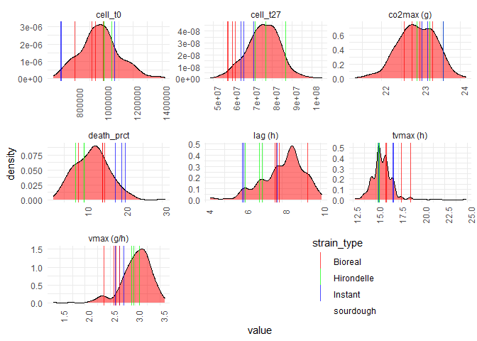
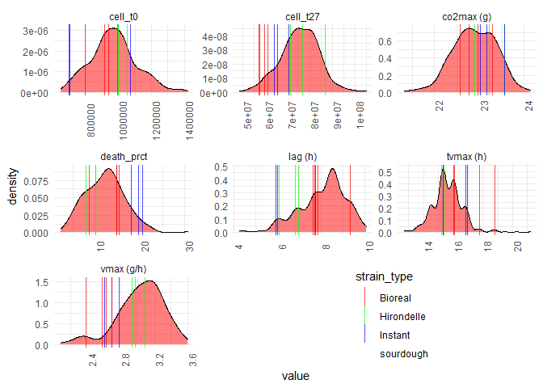
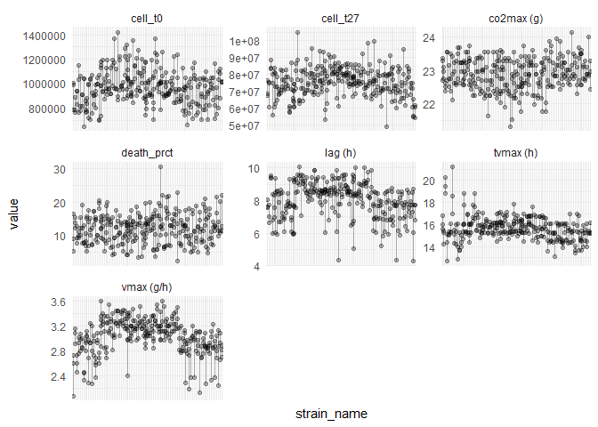

```r
library(magrittr)
library(tidyr)
library(dplyr)
library(stringr)
library(ggplot2)
```

# Initialisation and data import

```r
source("scripts/init.R")
source("scripts/import_data.R")

glimpse(data_phenot_parms_clean)
```

```
## Rows: 1,995
## Columns: 6
## $ robot_id    <chr> "R20-20210930-001", "R20-20210930-001", "R20-20210930-001"~
## $ strain_name <chr> "LB-PD7-T1-1", "LB-PD7-T1-1", "LB-PD7-T1-1", "LB-PD7-T1-1"~
## $ bloc        <fct> 3, 3, 3, 3, 3, 3, 3, 3, 3, 3, 3, 3, 3, 3, 3, 3, 3, 3, 3, 3~
## $ bloc_month  <fct> 1, 1, 1, 1, 1, 1, 1, 1, 1, 1, 1, 1, 1, 1, 1, 1, 1, 1, 1, 1~
## $ parameter   <chr> "cell_t0", "cell_t27", "co2max", "death_prct", "lag", "tvm~
## $ value       <dbl> 9.810000e+05, 7.640000e+07, 2.223684e+01, 1.330000e+01, 9.~
```

# Estimated parameters (clean data, without outliers)

## Discarded replicates

Here below, replicates considered as outliers were removed from the data. These last were considered as outliers if they had a `co2max` (maximum cumulated co2 production, '*upper*' asymptote of the Gompertz curve) under 20 grams. See report of the `2022-01-14` to see that this threshold makes sense. Here is the list of excluded outliers and the associated reason/hypothesis that they did not work.

Reasons are comments mostly from Diego, written in the `data_cyto.xslx` file, column `notes`.

```r
knitr::kable(excluded_replicates)
```

| robot_id         | strain_name    | reason                                                                                                                                                                                                                                                                                                                                |
|:---------------- |:-------------- |:------------------------------------------------------------------------------------------------------------------------------------------------------------------------------------------------------------------------------------------------------------------------------------------------------------------------------------- |
| R20-20210930-065 | LB-RT17-T1-3   | conta sur boite                                                                                                                                                                                                                                                                                                                       |
| R20-20210930-074 | LB-RT17-T1-3   | conta sur boite                                                                                                                                                                                                                                                                                                                       |
| R20-20211012-034 | LB-RT17-T1-3   | conta sur boite                                                                                                                                                                                                                                                                                                                       |
| R20-20211207-007 | MB-ST23-T1-4   | conta sur boite                                                                                                                                                                                                                                                                                                                       |
| R20-20211207-040 | MB-ST23-T1-3   | conta sur boite                                                                                                                                                                                                                                                                                                                       |
| R20-20211207-067 | AM-PG9-T5-6    | theo: fermentation pas finie ? Il semble que l'inoculation faible (cell_t0=788000, au lieu d'une moyenne de 1000000) a eu un effet sur la latence et sur le CO2max qui ne semble pas être atteint, au vu de la courbe. Je ne supprime que ce réplicat pour cette souche pour le moment, car les autres semblent avoir bien fonctionné |
| R20-20211207-069 | MB-MAISON-T1-4 | conta sur boite                                                                                                                                                                                                                                                                                                                       |
| R20-20211215-018 | MB-MAISON-T1-5 | conta sur boite                                                                                                                                                                                                                                                                                                                       |
| R20-20211215-032 | MB-MAISON-T1-5 | conta sur boite                                                                                                                                                                                                                                                                                                                       |
| R20-20211215-069 | MB-MAISON-T1-5 | conta sur boite                                                                                                                                                                                                                                                                                                                       |

## Global distribution of parameters

Here is now the distribution of the clean data, and a visualisation of the position of commercial strains in the distribution of each parameter.

First, the traits `cell_t27`, `death_prct` and `vmax` (mostly, in fact) suggest that commercial strains do less well than sourdough ones in this environment (respectively, more mortality for them, less leaving cells at the end, and less capacity to consume the ressources of the environment). And that the *Hirondelle* strain shows a better fitness and activity in this environment than the two other commercial ones.

Autre chose d'intéressant, est que les souches commerciales n'ont pas l'air de driver le phénotype des autres souches, ce qui aurait lieu si des souches étaient finalement des souches commerciale survenue par contamination, mais ce n'est qu'une premier aperçu.

COncerning the `lag` (previously called `t1g`) variable, the local maxima of the distribution are due to a bias in the methods because its value is taken as the first time at which the cumulated co2 production is equal to 1 gram. And because the time is discrete, `lag` values are accumulated at these 'discrete time positions'. We can see the same problem for the `tvmax` variable.

```r
data_phenot_parms_clean %>%
  mutate(parameter = add_units(parameter),
         strain_type = strains$strain_type[match(strain_name, strains$strain_name)]) %>%
  ggplot(.) +
  aes(x = value) +
  geom_density(fill = alpha("red", 0.5)) +
  geom_vline(aes(xintercept = value, color = strain_type)) +
  scale_color_manual(values = strain_types_cols) +
  facet_wrap(~parameter, scales = "free") +
  theme_minimal() +
  theme(legend.position = c(0.7,0.1), axis.text.x = element_text(angle = 90))
```

<!-- -->

## Intra-strain variance

It looks that there is no more appearing outliers, or maybe one for the `vmax` and `tvmax` variables, on the left. It looks that it an outlier strain, not a single replicates.

There is some intra-strain variance : results are not exactly the same for each strain between replicates.

```r
data_phenot_parms_clean %>%
  mutate(parameter = add_units(parameter)) %>%
  ggplot(.) + 
  aes(y = value, group = strain_name, x = strain_name) +
  geom_point(alpha = 0.3) +
  geom_line(alpha = 0.3) +
  facet_wrap(~parameter, scales = "free") +
  theme_minimal() +
  theme(axis.text.x = element_blank())
```

<!-- -->

## Distribution of intra-strain variance (standard deviation)

```r
data_phenot_parms_clean %>%
  mutate(parameter = add_units(parameter)) %>%
  group_by(strain_name, parameter) %>%
  summarise(strain_var = sd(value)) %>%
  ggplot(., aes(x = strain_var)) +
  geom_histogram(fill = alpha("green", 0.5)) +
  facet_wrap(~parameter, scales = "free") +
  theme_minimal()
```

<!-- -->
