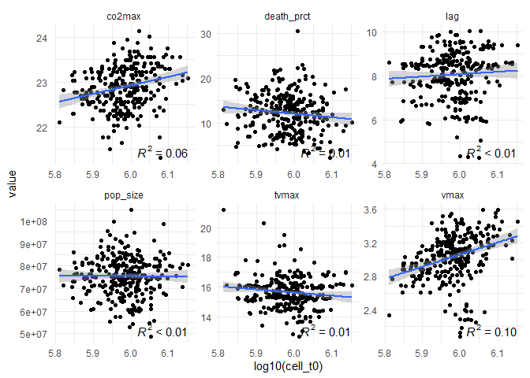
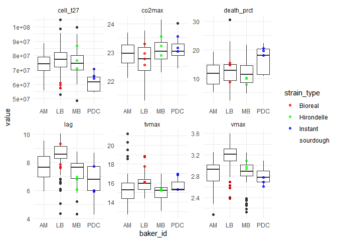

```r
library(magrittr)
library(tidyr)
library(dplyr)
library(stringr)
library(ggplot2)
```


# Initialisation and data import


```r
source("scripts/init.R")
source("scripts/import_data.R")

glimpse(data_phenot_parms_clean)
```

```
## Rows: 1,995
## Columns: 6
## $ robot_id    <chr> "R20-20210930-001", "R20-20210930-001", "R20-20210930-001"~
## $ strain_name <chr> "LB-PD7-T1-1", "LB-PD7-T1-1", "LB-PD7-T1-1", "LB-PD7-T1-1"~
## $ bloc        <fct> 3, 3, 3, 3, 3, 3, 3, 3, 3, 3, 3, 3, 3, 3, 3, 3, 3, 3, 3, 3~
## $ bloc_month  <fct> 1, 1, 1, 1, 1, 1, 1, 1, 1, 1, 1, 1, 1, 1, 1, 1, 1, 1, 1, 1~
## $ parameter   <chr> "cell_t0", "cell_t27", "co2max", "death_prct", "lag", "tvm~
## $ value       <dbl> 9.810000e+05, 7.640000e+07, 2.223684e+01, 1.330000e+01, 9.~
```


# Inoculation effect

I wanted to check if the quantity of inoculated cells had an effect on the lag and the time at which the flow rate is maximum.

There is no evident trend, but maybe it could be useful to include it as a random effect in our models, just to see it some variability is caught by it.


```r
data_phenot_parms_clean %>%
  filter(parameter %in% c("lag","tvmax","cell_t0")) %>%
  select(robot_id, parameter, value) %>% 
  unique() %>%
  pivot_wider(names_from = parameter, values_from = value) %>%
  pivot_longer(cols = c("lag","tvmax"), names_to = "parameter", values_to = "value") %>%
  ggplot(aes(y = value, x = cell_t0)) +
  facet_wrap(~ parameter, scales = "free") +
  geom_point() +
  theme_minimal()
```

<!-- -->


# Flour effect

Pas d'effet flagrant.


```r
data_phenot_parms_clean %>%
  filter(parameter != "cell_t0") %>%
  mutate(flour_id = strains$flour_id[match(strain_name, strains$strain_name)], 
         flour_type = flours$mill_type[match(flour_id, flours$flour_id)]) %>%
  filter(!is.na(flour_type)) %>%
  ggplot() +
  aes(x = flour_type, y = value) +
  geom_boxplot() +
  facet_wrap(~parameter, scales = "free") +
  theme_minimal()
```

<!-- -->
# Wheat type effect

Maybe a small effect on the `lag`


```r
data_phenot_parms_clean %>%
  filter(parameter != "cell_t0") %>%
  mutate(flour_id = strains$flour_id[match(strain_name, strains$strain_name)], 
         wheat_type = flours$wheat_type[match(flour_id, flours$flour_id)]) %>%
  filter(!is.na(wheat_type)) %>%
  ggplot() +
  aes(x = wheat_type, y = value) +
  geom_boxplot() +
  facet_wrap(~ parameter, scales = "free") +
  theme_minimal()
```

<!-- -->


# Baker effect

Il y a un effet boulanger clair. Cet effet boulanger peut aussi être confondu avec un "*effet levure commerciale*" qui a pu coloniser l'ensemble des levains d'une même boulanger.

La position des souches commerciales sur la figure laisse supposer cette hypothèse de colonisation partiel des levains par les souches commerciales.


```r
data_phenot_parms_clean %>%
  filter(parameter != "cell_t0") %>%
  mutate(baker_id = strains$baker_id[match(strain_name, strains$strain_name)],
         strain_type = strains$strain_type[match(strain_name, strains$strain_name)]) %>%
  filter(!is.na(baker_id)) %>%
  ggplot() +
  aes(x = baker_id, y = value) +
  geom_boxplot() +
  geom_point(aes(color = strain_type)) +
  scale_color_manual(values = strain_types_cols) +
  facet_wrap(~ parameter, scales = "free") +
  theme_minimal()
```

<!-- -->


# Backslopping effect

Pas d'effet clair


```r
data_phenot_parms_clean %>%
  filter(parameter != "cell_t0") %>%
  mutate(backslopping = strains$backslopping[match(strain_name, strains$strain_name)]) %>%
  filter(!is.na(backslopping)) %>%
  ggplot() +
  aes(x = backslopping, y = value) +
  geom_boxplot() +
  facet_wrap(~parameter, scales = "free") +
  theme_minimal()
```

<!-- -->


# Block effect

## For the complete data, regardless to the distribution of replicates in different blocks

Il semble y avoir un certain effet bloc sur `lag` et `vmax`.


```r
data_phenot_parms_clean %>%
  filter(parameter != "cell_t0") %>%
  ggplot() +
  aes(x = bloc_month , y = value) +
  geom_boxplot() +
  facet_wrap(~parameter, scales = "free") +
  theme_minimal()
```

<!-- -->


## Only for the strains that are represented in both blocks

Only 6 strains have replicates in the two blocks. They are all from the same baker (=LB). So that is good because it is less crossed variables. But by evaluating the block effect only on these baker's strains, we make the assumption that there is no interaction between `block` and `baker` variables : assumption that makes sense to me. I don't see how we could have an interaction between them.

These 6 strains have 6 replicates each of them, 3 in each month bloc.


```r
strains_in_both <- data_phenot_parms_clean %>%
  select(strain_name, bloc_month) %>%
  unique() %>%
  group_by(strain_name) %>%
  summarise(n = n()) %>%
  filter(n > 1) %>%
  select(strain_name) %>% 
  flatten_chr()

strains_in_both
```

```
## [1] "LB-GP4-T1-10"  "LB-PD7-T32-3"  "LB-RG15-T1-1"  "LB-RT17-T32-1"
## [5] "LB-SP22-T32-3" "LB-SR24-T1-23"
```

```r
length(strains_in_both)
```

```
## [1] 6
```


In the figure below, we roughly have the same trends than in the full data version just here above. Except for the $t_{Vmax}$ parameter. So it seems to be representative to the whole data trend. And let's try to 


```r
data_phenot_parms_clean %>%
  filter(parameter != "cell_t0",
         strain_name %in% strains_in_both) %>%
  ggplot() +
  aes(x = bloc_month , y = value) +
  geom_boxplot() +
  facet_wrap(~parameter, scales = "free") +
  theme_minimal()
```

<!-- -->


# What's next ?

I'm now doing both versions of the analysis (1) with block as random effect and (2) the data pre-correction with the estimated block effect.

