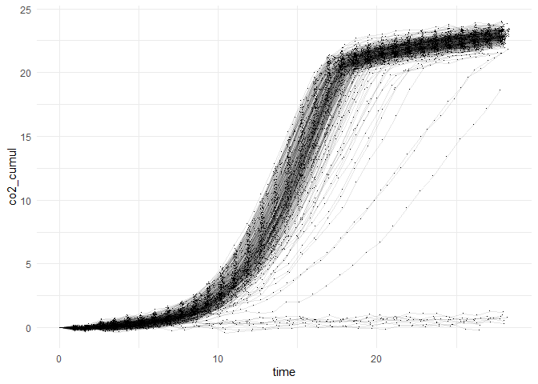
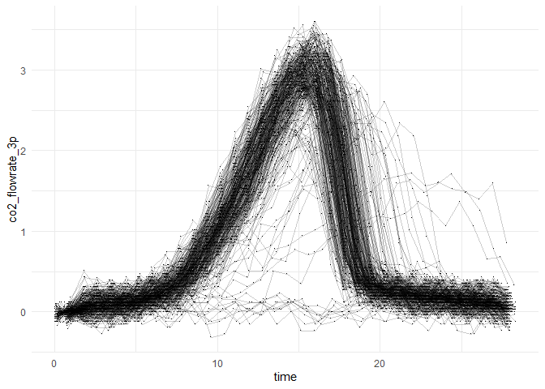

``` r
library(magrittr)
library(dplyr)
library(stringr)
library(ggplot2)
```

# Data import

``` r
data_phenot <- read.csv("data/data_robot/data_phenot.csv") %>%
  mutate(date_hour = as.Date(date_hour, format = "%d/%m/%Y %H:%M:%S")) %>%
  as_tibble()
head(data_phenot)
```

    ## # A tibble: 6 x 6
    ##   robot_id         date_hour   time weight_loss position tube_format
    ##   <chr>            <date>     <dbl>       <dbl>    <int> <chr>      
    ## 1 R20-20210930-001 2021-09-30 0.607        42.9        1 R20        
    ## 2 R20-20210930-001 2021-09-30 1.45         42.9        1 R20        
    ## 3 R20-20210930-001 2021-09-30 2.29         42.9        1 R20        
    ## 4 R20-20210930-001 2021-09-30 3.13         42.9        1 R20        
    ## 5 R20-20210930-001 2021-09-30 3.97         42.9        1 R20        
    ## 6 R20-20210930-001 2021-09-30 4.82         42.9        1 R20

# Functions

`weight_to_cumul` : function converting weight loss to cumulated CO2
production with the assumption that the lost weight is only/mostly CO2.

*Author : Hugo Devillers*

``` r
weight_to_cumul <- function(w, start = 2, t.ref = 2, vol = 15.2) {

  # Compute the weight of reference
  w.ref <- NULL
  w.len <- length(w)
  if( length(t.ref) == 1 ) {
    w.ref <- rep(w[t.ref], w.len)
  } else {
    w.ref <- rep(mean(w[t.ref]), w.len)
  }
  
  # Compute the cumulated values
  out <- (w.ref - w) / vol * 1000
  
  # Reset to 0 first values if required
  if( start > 1) {
    out[seq(1, start-1, by=1)] <- 0
  }
  
  return(out)
}
```

`moving_diff` : function computing a moving difference between points
separated of l-1 points to estimate the local slope (i.e. CO2 flow rate,
here) in the middle of these two points.

*Author : Hugo Devillers*

``` r
moving_diff <- function(x, ti, l=3) {
  
  # Extract parameters
  r <- floor(l/2)
  n <- length(x)
  
  # Extend time
  dt1 <- ti[2] -ti[1]
  dtn <- ti[n] - ti[n-1]
  exti1 <- seq(ti[1] - n * dt1, ti[1] - dt1, by = dt1)
  extin <- seq(ti[n] + dtn, ti[n] + n * dtn, by= dtn)
  ti <- c(exti1, ti, extin)
  
  # Extend x (values)
  x <- c(rep(x[1], r), x, rep(x[n], r))
  
  # New parameters
  n <- length(x)
  from <- 1:(n-l+1)
  to <- l:n
  
  # Compute sliding weighted diff
  tmp <- mapply(function(fr, to, r, x, ti){
    num <- mean(x[(fr+r):to]) - mean(x[fr:(fr+r)])
    #den <- mean(ti[(fr+r):to]) - mean(ti[fr:(fr+r)])
    den <- mean(ti[c((fr+r),to)]) - mean(ti[c(fr,(fr+r))])
    return( num / den )
  }, fr = from, to = to, MoreArgs = list(x = x, r=r, ti=ti), SIMPLIFY = TRUE)
  
  # Return the output
  return(tmp) 
}
```

# Extraction of parameters

Computes of CO<sub>2</sub> cumulation and CO<sub>2</sub> flow rate at
each time *t*.

``` r
data_phenot %<>%
  group_by(robot_id) %>%
  arrange(robot_id, time) %>%
  mutate(co2_cumul = weight_to_cumul(w = weight_loss, start = 2, t.ref = c(2,3), 
                                     vol = 15.2),
         co2_flowrate_3p = moving_diff(x = co2_cumul, ti = time, l = 3)) %>%
  ungroup()
```

# Extracts statistics from the CO2 cumulation and CO2 flow rate

``` r
data_phenot_parms <- data_phenot %>%
  group_by(robot_id) %>%
  summarise(date_start = min(date_hour),
            date_end = max(date_hour),
            co2max = max(co2_cumul),
            vmax = max(co2_flowrate_3p),
            tvmax = time[which(co2_flowrate_3p == max(co2_flowrate_3p))],
            latency = time[min(which(co2_cumul > 1))]) %>% 
  ungroup()
```

`date_start` : moment of the first mesure

`date_end` : Moment of the last measure

`co2max` : Maximum cumulated CO2

`vmax` : Maximum CO2 flow rate

`tvmax` : Time at the maximum CO2 flow rate

`latency` : time at which cumulated CO2 reaches 1 for the first time

# Data overview

## Trends of weight loss time

``` r
ggplot(data_phenot) +
  aes(x = time, y = co2_cumul, group = robot_id) +
  geom_point(shape = ".") +
  geom_line(alpha = 0.2) +
  theme_minimal()
```

<!-- -->

## Trends of flow rate over time

``` r
ggplot(data_phenot) +
  aes(x = time, y = co2_flowrate_3p, group = robot_id) +
  geom_point(shape = ".") +
  geom_line(alpha = 0.2) +
  theme_minimal()
```

<!-- -->
